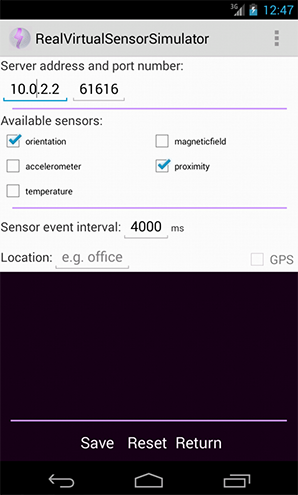
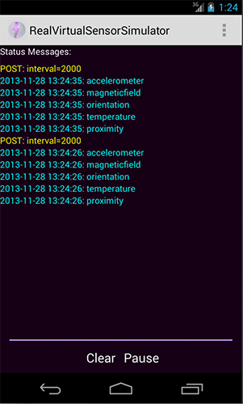
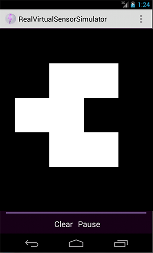
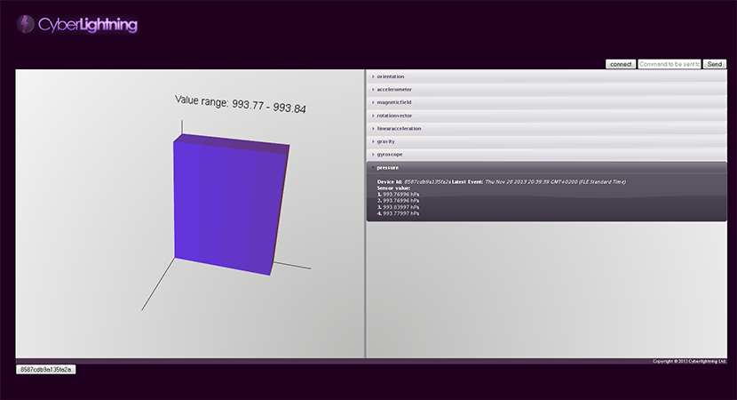
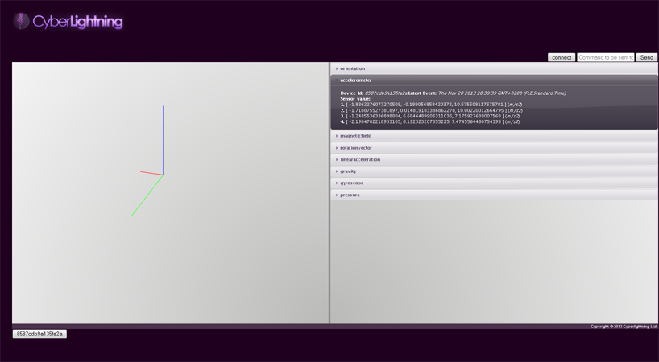
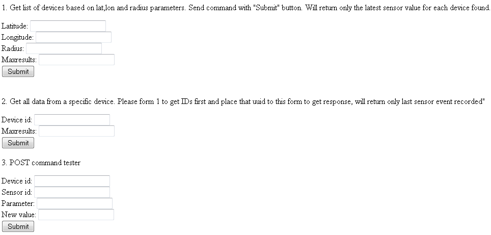
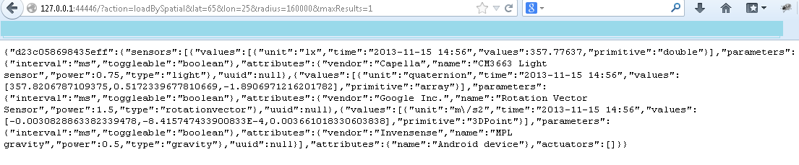

# Real Virtual Interaction - User and Programmers Guide

## Contents

1.  [Introduction](#Introduction)
2.  [User guide](#User_guide)
    1.  [Real Virtual Sensor Simulator](#Real_Virtual_Sensor_Simulator)
    2.  [Publish/Subscribe Web Application](#Publish.2FSubscribe_Web_Application)
    3.  [Request/Response Web Application](#Request.2FResponse_Web_Application)
    4.  [Known Issues](#Known_Issues)
3.  [Programmers guide](#Programmers_guide)
    1.  [API examples for device application developers](#app_dev_examples)
    2.  [API examples for web client application developers](#app_client_examples)
    3.  [API examples for service developers](#app_service_examples)
 

# Introduction
This documents describes instructions on how to use demo applications designed for Real Virtual Interaction backend ([FIWARE Catalogue link](http://catalogue.fiware.org/enablers/real-virtual-interaction)). For server installation, please refer to [Real Virtual Interaction - Installation and Administration Guide](/plugins/mediawiki/wiki/fiware/index.php/Real_Virtual_Interaction_-_Installation_and_Administration_Guide "Real Virtual Interaction - Installation and Administration Guide"). This guide consist of an Android application for simulating actuators and sensors, and publish/subscribe and request/response clients.

This document is divided in to three parts:
* Real Virtual Sensor Simulator (Android application)
* Publish Subscribe client (JavaScript web application)
* Request Response client (HTML web application)

Source codes (for latest version of code):
* [RealVirtual source](https://github.com/Cyberlightning/RealVirtualInteraction "https://github.com/Cyberlightning/RealVirtualInteraction")

This User and Programmers Guide relates to the Real Virtual Interaction GE which is part of the [Advanced Middleware and Web User Interfaces chapter](/plugins/mediawiki/wiki/fiware/index.php/Advanced_Middleware_and_Web_UI_Architecture "Advanced Middleware and Web UI Architecture"). For more background information on this GE, also refer to its [API specification](http://docs.realvirtualinteraction.apiary.io/#).

# User guide

The user guides are meant for end-users using these application to test the Real Virtual Interaction Server. This guide includes 
information regarding usage of these applications.

## Real Virtual Sensor Simulator

This Android application is designed to be a demo application for the Real Virtual Interaction backend. The application reads sensors available on an android device and sends this information to the Real Virtual Interaction backend which stores this information to be used by other demo applications such as the publish-subscribe client (JavaScript web application) and the request-response client (HTML web application). In essence this application emulates real world sensor data. Also this application offers one "actuator" which is the display. This Android application requires API level 14 device to work (see further details about suitable devices [here](http://source.android.com/source/build-numbers.html "http://source.android.com/source/build-numbers.html")). Also user needs to enable network access and preferably GPS (optional).

From settings view end-user can configure what sensors are to be listened and send to real virtual interaction server. Also user can define a custom connection information. Available sensors are detected from the Android device and updated dynamically on screen. The view supports changing orientation and uses shared preferences to save user data. The location field can be used to give textual representation in where this particular device is currently. It can be a name of a room, building or address. It is up to client developers to make use of this data. When user clicks the GPS check box system will try to automatically enable GPS, but this is not supported in all Android versions. The GPS check box will be disable if there is no GPS available in the system.

The main view shows the communication between the client and the server. In main view the text colored as "cyan" show outbound messages. Due to nature of UDP traffic all sent messages are being shown, but there is no verification whether these messages have reached the server. Received messages are being shown in "yellow" color. The idea is that the device will publish sensor and actuator interfaces using the RESTful data format. 

This view represent a case where device display acts as an actuator where a remote HTTP POST call can be used to trigger the marker view display and what marker is to be shown. The application contains 60 ready made augmented reality markers used by
the software. HTTP POST calls are being send to the real virtual interaction backend which will extract the query part and pass the message to last known IP address of the connected Android application. Android application will parse the received message and if it is in the right format, it will automatically change main view to show the marker requested in the query string. Otherwise the message will be display as a general inbound message with "yellow" color on the main view. 

## Publish/Subscribe Web Application 

This application is designed to receive and send data to the Android application by using the Real Virtual Interaction backend as a mediator. 

The view is divided in two sections. The section in right appends information received from each individual sensor as Jquery tab widgets. By clicking the header of tab you can expand the tab to show information within that tab and thus from individual sensor. There are some basic data implemented in the current design. When new event is being received from the server these tabs get redrawn. If new sensors associated with selected device arrive new tabs are being appended to this view. During this update all new values are being appended to existing tabs as well. Each tab holds history for 5 latest events. [Android Developers](http://developer.android.com/reference/android/hardware/SensorEvent.html#values "http://developer.android.com/reference/android/hardware/SensorEvent.html#values")offers detailed description about sensors events. The left view show the visualization of the events. The application currently supports three formats "double, array, 3DPoint". These are being referred as primitives in the code. The decision about which type of graph to draw depends on the primitive type of the data. This information is being embedded in the RESTful data format.  

The title of tab acts as a link that opens a visual representation  of the data being withhold in the particular tab/sensor. Keep in mind that the link is a standard href and is only triggered from pixels of link text and thus may require few clicks occasionally. 

ONKO TÄSSÄ JOKU ONGELMA??????

Figure 4 shows a view for all single entry values such represented by "primitive"&nbsp;: "double" in the JSON string of that particular sensor. 5 latest values are being stored in the view each represented by a 3D bar. When 6th event arrive the oldest entry is removed and new added right of the coordinate system and each bar moved to left accordingly. This update is being seen live if the view is drawn while new event arrives to that particular sensor. Keep in mind that that the view is redrawn even when there is an event coming for ANY sensor.  

The view in Figure 5 shows a standard representation style for all "3Dpoint" type of arrays where each element represents X,Y,Z axis for instance.

## Request/Response Web Application

This application is a sample page which holds standard html form elements. One purpose of this page is to enable user to demo that the server actually is receiving the data from the Android application. Also this page acts as a sample of a 3rd party service querying data from the Real Virtual Interaction backend. Using the RESTful data format it could be possible to dynamically embed new html form elements in to a web page. For instance, the case 3 showing the POST call form element could be loaded with information ready on the input fields when the web page is being loaded by the user. 

  

[JSONLint](http://jsonlint.com/ "http://jsonlint.com/") is a good tool for validating and organizing the response query in more easily readable form.

## Known Issues

If the sensor event arrive to PubSub client faster than it is able finish a render cycle there will be problems with drawing and might cause instability depending on browser. Some browser might have a fixed FPS limit and thus the minimum interval sensor events should be 1000 ms / MAX_FRAME_RATE. The current application does not have any logic to handle such occurance.

Not all browsers support Web Socket or Web GL. Current versions of Chrome and FireFox have been tested to be working.

The PubSub web application and Android application might not handle small screens very well. With small screen it is possible that the 3D visualization of web application might be drawn in wrong location and in Android some screen sizes have not been tested.

# Programmers guide

The Real Virtual Sensor Simulator Android software can be imported in to an [Eclipse IDE](http://www.eclipse.org/downloads/ "http://www.eclipse.org/downloads/") as an Android project. You need to also download [Android SDK](https://developer.android.com/sdk/index.html "https://developer.android.com/sdk/index.html") and [ADT plugin](http://developer.android.com/tools/sdk/eclipse-adt.html "http://developer.android.com/tools/sdk/eclipse-adt.html"). Only way internal configurations can be changes is to download the source code and change them and compile a new .apk file. For using RealVirtuaInteraction backend, please have a look [API specification](http://docs.realvirtualinteraction.apiary.io/#).

You can easily change the IP address if you wish to test the publish/subscrice client with the server locally or deploy it remotely by changing the IP address. 

The key words "MUST", "MUST NOT", "REQUIRED", "SHALL", "SHALL NOT", "SHOULD", "SHOULD NOT", "RECOMMENDED", "MAY", and "OPTIONAL" in this document are to be interpreted as described in [RFC2119]. The key word REMOTEHOST can be replaced by either IP address or DNS host name. Also port number for middleware service can differ from IANA standard which is 80 for the WebSocket and 8080 for HTTP. The key words GET,POST,PUT and DELETE are http methods and appear capitalized each time they occur in the specifications.

Security implementations are not included in this specifications as they are highly dependable on type of 
middleware service and chosen security level. For controlled public access api-keys or session-ids could be used. Alternatively for private access login information could be included in queries.

**API examples for device application developers**

The Realvirtualinteraction backend will listen to incoming UDP packets and will drop packets that do not conform with the RESTful data format specification (version 1.0). The payload string MAY be Gzip compressed. Below
JSON string is a example how the device developers should public sensor/actuator information to the server. The "dataformat_version" field will be removed after the packet is being received by the server and will not be passed on to possible clients subscribed listening for incoming events. For instance the existing logic could be extended to include other fields such as API-KEY to ensure that only registered devices may publish to server. This could be the first step to add a layer of security. 

<pre>
{
  "dataformat_version": "1.0",
  "d23c058698435eff": {
    "d23c058698435eff": {
      "sensors": [
      {
        "value": {
          "unit": "uT",
          "primitive": "3DPoint",
          "time": "2014-02-19 09:40:06",
          "values": [
          17.819183349609375,
          0.07265311479568481,
          -0.4838427007198334
          ]
          },
          "configuration": [
          {
            "interval": "ms",
            "toggleable": "boolean"
          }
          ],
          "attributes": {
            "type": "orientation",
            "power": 0.5,
            "vendor": "Invensense",
            "name": "MPL magnetic field"
          }
          },
          {
            "value": {
              "unit": "uT",
              "primitive": "3DPoint",
              "time": "2014-02-19 09:40:06",
              "values": [
              17.819183349609375,
              0.07265311479568481,
              -0.4838427007198334
              ]
              },
              "configuration": [
              {
                "interval": "ms",
                "toggleable": "boolean"
              }
              ],
              "attributes": {
                "type": "gyroscope",
                "power": 0.5,
                "vendor": "Invensense",
                "name": "MPL magnetic field"
              }
              },
              {
                "value": {
                  "unit": "uT",
                  "primitive": "3DPoint",
                  "time": "2014-02-19 09:40:06",
                  "values": [
                  17.819183349609375,
                  0.07265311479568481,
                  -0.4838427007198334
                  ]
                  },
                  "configuration": [
                  {
                    "interval": "ms",
                    "toggleable": "boolean"
                  }
                  ],
                  "attributes": {
                    "type": "magneticfield",
                    "power": 0.5,
                    "vendor": "Invensense",
                    "name": "MPL magnetic field"
                  }
                  },
                  {
                    "value": {
                      "unit": "m/s2",
                      "primitive": "3DPoint",
                      "time": "2014-02-19 09:40:06",
                      "values": [
                      0.006436614785343409,
                      0.003891906701028347,
                      -0.5983058214187622
                      ]
                      },
                      "configuration": [
                      {
                        "interval": "ms",
                        "toggleable": "boolean"
                      }
                      ],
                      "attributes": {
                        "type": "linearacceleration",
                        "power": 1.5,
                        "vendor": "Google Inc.",
                        "name": "Linear Acceleration Sensor"
                      }
                    }
                    ],
                    "actuators": [
                    {
                      "configuration": [
                      {
                        "value": "100",
                        "unit": "percent",
                        "name": "viewsize"
                      }
                      ],
                      "actions": [
                      {
                        "value": "[marker1,marker2,marker3,marker4]",
                        "primitive": "array",
                        "unit": "string",
                        "parameter": "viewstate"
                      }
                      ],
                      "callbacks": [
                      {
                        "target": "viewstate",
                        "return_type": "boolean"
                      }
                      ],
                      "attributes": {
                        "dimensions": "[480,800]"
                      }
                    }
                    ],
                    "attributes": {
                      "name": "Android device"
                    }
                  }
                }
              }
</pre>

**API examples for web client application developers**

Following code and header samples enable a real-time connection over TCP/IP to be formed with a server application. Once a connection is established, sensor events MAY be pushed to clients 
from server in real-time. The connection is full-duplex meaning that also a client MAY send messages directly to sensors in through a web server. This sort of full-duplex connection MAY be
considered as publish/subscribe type of connection where client MAY choose which sensor to subscribe to receive event updates from. The web service SHALL provide the client a list of available sensors or 
OPTIONALLY a client MAY use third party service such as point-of-interest(POI) service to find sensors. WebSocket SHOULD be then used to form direct connection to the sensors through a IoT.Broker type of 
web server component.  

**JavaScript client sample:**

<pre>
function CreateWebSocket() {
  if ("WebSocket" in window) {
    ws = new WebSocket("ws://REMOTEHOST");
    ws.onopen = function() {
    alert("Connection established to web server"); 	 
    };

    ws.onmessage = function (evt) {
      alert("Message received from web server: " + evt.data); 
    };

    ws.onclose = function() {
      alert("Connection is closed...");
    };
  }else {
    alert("WebSocket NOT supported by your Browser!");
  }
}
</pre>

The above JavaScript example initiates a connection to a webserver and starts
  handshake with following HTTP header. 

**REQUEST HEADER:**
<pre>GET /chat HTTP/1.1
  Host: REMOTEHOST
  Upgrade: websocket
  Connection: Upgrade
  Sec-WebSocket-Key: dGhlIHNhbXBsZSBub25jZQ==
  Origin: LOCALHOST
  Sec-WebSocket-Protocol: chat, superchat
  Sec-WebSocket-Version: 13
</pre>

Server MUST respond with following HTTP header or handshake fails. Notice that the Sec-WebSocket-Accept key is unique and MUST be created by server instance. Detailed instructions can be found from [RFC6455](http://tools.ietf.org/html/rfc6455 "http://tools.ietf.org/html/rfc6455").

**RESPONSE HEADER:**

<pre>HTTP/1.1 101 Switching Protocols
  Upgrade: websocket
  Connection: Upgrade
  Sec-WebSocket-Accept: s3pPLMBiTxaQ9kYGzzhZRbK+xOo=
  Sec-WebSocket-Protocol: chat
</pre>

<a name="app_service_examples">

**API examples for service developers**

Following example show how backend services SHALL communicate between each other using HTTP GET/POST methods. OPTIONALLY other HTTP methods such as PUT and DELETE MAY be used, but they are not supported by the real virtual interaction backend deliverable.

  
*1\. Request all sensors with bound by a specific spatial bounds*

A middleware web service SHOULD offer ways for other middleware services to specify retrievable devices by location and spatial bounds or OPTIONALLY by an IP address space. The spatial bound SHALL be either a square area with minimum and maximum values for coordinates, a circle with a centerpoint and radius or a complex shape.

Following example shows an example where POI middleware service requests all devices available within a specific circular area with a geo-coordinate center point and radius in meters.

Below is a sample code that can be used to form the following request query:    

<pre>&lt;form action="http://127.0.0.1:44446/" method="get"&gt;
  &lt;input type="hidden" name="action" value="loadById"&gt;
  Device id: &lt;input type="text" name="device_id"&gt;&lt;br&gt;
  Maxresults: &lt;input type="text" name="maxResults"&gt;&lt;br&gt;
  &lt;input type="submit" value="Submit"&gt;
  &lt;/form&gt;
</pre>

Below is a sample request header as received by the real virtual interaction backend:

**REQUEST HEADER:**
<pre>GET /?action=loadBySpatial&amp;lat=65.4&amp;lon=25.4&amp;radius=1500&amp;maxResults=1 HTTP/1.1
  Host: 127.0.0.1:44446
  User-Agent: Mozilla/5.0 (X11; Ubuntu; Linux x86_64; rv:25.0) Gecko/20100101 Firefox/25.0
  Accept: text/html,application/xhtml+xml,application/xml;q=0.9,*/*;q=0.8
  Accept-Language: en-US,en;q=0.5
  Accept-Encoding: gzip, deflate
  Connection: keep-alive
</pre>
Below is a sample reponse header as send by the real virtual interaction backend. 

**RESPONSE HEADER:**

<pre> 
HTTP/1.1 200 OK
Access-Control-Allow-Origin: * 
Content-Type: text/plain; charset=utf-8
Content-Length: 1767

Connection: close{
 "d23c058698435eff": {
   "sensors": [
   {
     "value": {
       "unit": "uT",
       "primitive": "3DPoint",
       "time": "2013-12-10 15:02:39",
       "values": [
       0.07543107122182846,
       -0.015922529622912407,
       0.01725415326654911
       ]
       },
       "configuration": [
       {
        "interval": "ms",
        "toggleable": "boolean"
      }
      ],
      "attributes": {
        "type": "orientation",
        "power": 0.5,
        "vendor": "Invensense",
        "name": "MPL magnetic field"
      }
      },
      {
        "value": {
          "unit": "rad/s",
          "primitive": "3DPoint",
          "time": "2013-12-10 15:02:39",
          "values": [
          355.9173278808594,
          -85.8130111694336,
          4.165353775024414
          ]
          },
          "configuration": [
          {
            "interval": "ms",
            "toggleable": "boolean"
          }
          ],
          "attributes": {
            "type": "gyroscope",
            "power": 0.5,
            "vendor": "Invensense",
            "name": "MPL Gyro"
          }
          },
          {
            "value": {
              "unit": "uT",
              "primitive": "3DPoint",
              "time": "2013-12-10 15:02:39",
              "values": [
              0.07543107122182846,
              -0.015922529622912407,
              0.01725415326654911
              ]
              },
              "configuration": [
              {
                "interval": "ms",
                "toggleable": "boolean"
              }
              ],
              "attributes": {
                "type": "magneticfield",
                "power": 0.5,
                "vendor": "Invensense",
                "name": "MPL magnetic field"
              }
              },
              {
                "value": {
                  "unit": "m/s2",
                  "primitive": "3DPoint",
                  "time": "2013-12-10 15:02:39",
                  "values": [
                  352.0169982910156,
                  -85.75300598144531,
                  4.191023826599121
                  ]
                  },
                  "configuration": [
                  {
                    "interval": "ms",
                    "toggleable": "boolean"
                  }
                  ],
                  "attributes": {
                    "type": "linearacceleration",
                    "power": 1.5,
                    "vendor": "Google Inc.",
                    "name": "Linear Acceleration Sensor"
                  }
                }
                ],
                "actuators": [
                {
                  "configuration": [
                  {
                    "value": "100",
                    "unit": "percent",
                    "name": "viewsize"
                  }
                  ],
                  "actions": [
                  {
                    "value": "[marker1,marker2,marker3,marker4,marker6,marker7,marker8,marker9,marker10,marker11,marker12,marker13,marker14,marker15,marker15,marker16,marker17,marker18,marker19]",
                    "primitive": "array",
                    "unit": "string",
                    "parameter": "viewstate"
                  }
                  ],
                  "callbacks": [
                  {
                    "target": "viewstate",
                    "return_type": "boolean"
                  }
                  ],
                  "attributes": {
                    "dimensions": "[480,800]"
                  }
                }
                ],
                "attributes": {
                  "name": "Android device"
                }
              }
            }

</pre>

The response header returns  radius and geo-coordinates which were set by the original request query. <i>Devices</i> JSONArray object contains all devices matching the query. Each device MAY contain multiple sensors and actuators. 

2\. Request all data from a specific device by device UUID

A device SHOULD be considered as a micro controller board with capabilitis required to generate an <i>uuid</i>. A device MAY contain any number of sensors and actuators, and in any combination. If the requested sensor or actuator does not have uuid the request MUST target the device containing the desired sensor or actuator. 

Following example shows how a middleware service retrieves all available information regarding a specific device by using an *uuid* string identifier.

Below is a sample code that can be used to form the following request query: 

<pre>&lt;form action="http://127.0.0.1:44446/" method="get"&gt;
  &lt;input type="hidden" name="action" value="loadBySpatial"&gt;
  Latitude: &lt;input type="text" name="lat"&gt;&lt;br&gt;
  Longitude: &lt;input type="text" name="lon"&gt;&lt;br&gt;
  Radius: &lt;input type="text" name="radius"&gt;&lt;br&gt;
  Maxresults: &lt;input type="text" name="maxResults"&gt;&lt;br&gt;
  &lt;input type="submit" value="Submit"&gt;
  &lt;/form&gt;
</pre>

Below is a sample request header as received by the real virtual interaction backend. 

**REQUEST HEADER:**
<pre>GET /?action=loadById&amp;device_id=440cd2d8c18d7d3a&amp;maxResults=1 HTTP/1.1
  Host: 127.0.0.1:44446
  User-Agent: Mozilla/5.0 (X11; Ubuntu; Linux x86_64; rv:25.0) Gecko/20100101 Firefox/25.0
  Accept: text/html,application/xhtml+xml,application/xml;q=0.9,*/*;q=0.8
  Accept-Language: en-US,en;q=0.5
  Accept-Encoding: gzip, deflate
  Connection: keep-alive
</pre>

Below is a sample response header as send by the real virtual interaction backend. 
**RESPONSE HEADER:**
<pre> 
HTTP/1.1 200 OK
Access-Control-Allow-Origin: * 
Content-Type: text/plain; charset=utf-8
Content-Length: 1767

Connection: close{
 "440cd2d8c18d7d3a": {
   "actuators": [
   {
     "configuration": [
     {
       "unit": "percent",
       "name": "viewsize",
       "value": "100"
     }
     ],
     "callbacks": [
     {
      "return_type": "boolean",
      "target": "viewstate"
    }
    ],
    "attributes": {
      "dimensions": "[480,800]"
      },
      "actions": [
      {
        "unit": "string",
        "primitive": "array",
        "parameter": "viewstate",
        "value": "[marker1,marker2,marker3,marker4]"
      }
      ]
    }
    ],
    "sensors": [
    {
      "configuration": [
      {
        "toggleable": "boolean",
        "interval": "ms"
      }
      ],
      "values": [
      {
        "unit": "rads",
        "primitive": "3DPoint",
        "values": [
        21.117462158203125,
        -0.9801873564720154,
        -0.6045787930488586
        ],
        "time": "2013-12-10 10:07:30"
      }
      ],
      "attributes": {
        "vendor": "Invensense",
        "name": "MPL Gyro",
        "power": 0.5,
        "type": "gyroscope"
      }
      },
      {
        "configuration": [
        {
          "toggleable": "boolean",
          "interval": "ms"
        }
        ],
        "values": [
        {
          "unit": "ms2",
          "primitive": "3DPoint",
          "values": [
          149.10000610351562,
          420.20001220703125,
          -1463.9000244140625
          ],
          "time": "2013-12-10 10:07:30"
        }
        ],
        "attributes": {
          "vendor": "Invensense",
          "name": "MPL accel",
          "power": 0.5,
          "type": "accelerometer"
        }
        },
        {
          "configuration": [
          {
            "toggleable": "boolean",
            "interval": "ms"
          }
          ],
          "values": [
          {
            "unit": "uT",
            "primitive": "3DPoint",
            "values": [
            -0.08577163517475128,
            0.16211289167404175,
            9.922416687011719
            ],
            "time": "2013-12-10 10:07:30"
          }
          ],
          "attributes": {
            "vendor": "Invensense",
            "name": "MPL magnetic field",
            "power": 0.5,
            "type": "magneticfield"
          }
          },
          {
            "configuration": [
            {
              "toggleable": "boolean",
              "interval": "ms"
            }
            ],
            "values": [
            {
              "unit": "orientation",
              "primitive": "3DPoint",
              "values": [
              -0.004261057823896408,
              -0.017044231295585632,
              0.019174760207533836
              ],
              "time": "2013-12-10 10:07:30"
            }
            ],
            "attributes": {
              "vendor": "Invensense",
              "name": "MPL Orientation (android deprecated format)",
              "power": 9.699999809265137,
              "type": "orientation"
            }
          }
          ],
          "attributes": {
            "name": "Android device"
          }
        }
      }
</pre>

The above response shows a general description how a JSON object returned by the middleware service could look like. 

3\. Change value of a specific attribute of a sensor by ID, controller name, new value 

Middleware service MUST offer a way to change state of sensors or actuators. Sensors and actuators SHOULD publish configurable parameters. Middleware services MUST send state change requests as HTTP POST calls. POST request content MUST start with action definition.  

Following example shows how to use HTTP POST request to turn change augmented reality marker on an Android application remotely.

Below is a sample code that can be used to form the following request query: 

<pre>&lt;form action="http://127.0.0.1:44446/upload" enctype="multipart/form-data" method="post"&gt;
  Device id: &lt;input type="text" name="device_id"&gt;&lt;br&gt;
  Choose marker to upload: &lt;input type="file" name="datafile" size="40"&gt;&lt;/br&gt;
  &lt;input type="submit" value="Send"&gt;
</pre>

**REQUEST HEADER:**
<pre>POST / HTTP/1.1
  Host: 127.0.0.1:44446
  User-Agent: Mozilla/5.0 (X11; Ubuntu; Linux x86_64; rv:25.0) Gecko/20100101 Firefox/25.0
  Accept: text/html,application/xhtml+xml,application/xml;q=0.9,*/*;q=0.8
  Accept-Language: en-US,en;q=0.5
  Accept-Encoding: gzip, deflate
  Connection: keep-alive
  Content-Type: application/x-www-form-urlencoded
  Content-Length: 92

  action=update&amp;device_id=440cd2d8c18d7d3a&amp;sensor_id=display&amp;parameter=viewstate&amp;value=marker5
</pre>
**RESPONSE HEADER:**
<pre>HTTP/1.1 200 OK
  Access-Control-Allow-Origin: * 
  Content-Type: text/plain; charset=utf-8
  Content-Length: 6

  Connection: close

  200 OK
</pre>
Real virtual interaction backend uses the device_id parameter and looks up the IP address from reference table and passes only the content of the query forward to the particular sensor. If an IP address  is found from the reference table, the server will respond with 200 OK without actually knowing whether the message reached its destination as the transport mechanism is UDP.  Otherwise server will respond with 404 NOT FOUND.

**REQUEST RECEIVED BY SENSOR:**

<pre>
  action=update&amp;device_id=440cd2d8c18d7d3a&amp;sensor_id=display&amp;parameter=viewstate&amp;value=marker5
</pre>

***Possible response codes from sensors***

Following list includes those HTTP codes supported by the CoAP protocol. These codes SHOULD be returned by
sensors or actuators if they are able. The middleware service MUST respond to all
requests even if there is no response from a sensor. In such case the middleware SHALL implement
time-out after which a appropriate response MUST be generated.

<pre>
<code>
  | Code | Description                     | Reference |
  +------+---------------------------------+-----------+
  | 2.01 | Created                         | [RFCXXXX] |
  | 2.02 | Deleted                         | [RFCXXXX] |
  | 2.03 | Valid                           | [RFCXXXX] |
  | 2.04 | Changed                         | [RFCXXXX] |
  | 2.05 | Content                         | [RFCXXXX] |
  | 4.00 | Bad Request                     | [RFCXXXX] |
  | 4.01 | Unauthorized                    | [RFCXXXX] |
  | 4.02 | Bad Option                      | [RFCXXXX] |
  | 4.03 | Forbidden                       | [RFCXXXX] |
  | 4.04 | Not Found                       | [RFCXXXX] |
  | 4.05 | Method Not Allowed              | [RFCXXXX] |
  | 4.06 | Not Acceptable                  | [RFCXXXX] |
  | 4.12 | Precondition Failed             | [RFCXXXX] |
  | 4.13 | Request Entity Too Large        | [RFCXXXX] |
  | 4.15 | Unsupported Content-Format      | [RFCXXXX] |
  | 5.00 | Internal Server Error           | [RFCXXXX] |
  | 5.01 | Not Implemented                 | [RFCXXXX] |
  | 5.02 | Bad Gateway                     | [RFCXXXX] |
  | 5.03 | Service Unavailable             | [RFCXXXX] |
  | 5.04 | Gateway Timeout                 | [RFCXXXX] |
  | 5.05 | Proxying Not Supported          | [RFCXXXX] |
  +------+---------------------------------+-----------+
</code>
</pre>
